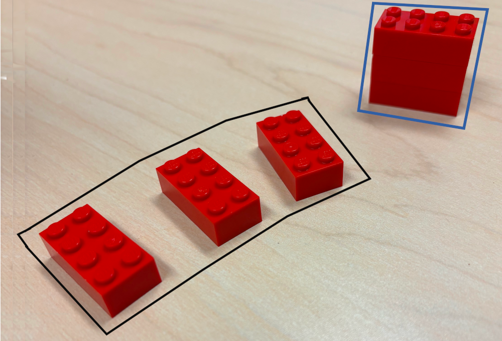

## Folding at Home

In class we had a really interesting discussion about the fold operation that is common in languages that fall into the functional programming paradigm. In this code walkthrough, we will look more closely at the fold operation, use it in Python and get ready to take the next steps (which will be our own implementation of the fold operation!).

> The fold operation is common in many langauges that fall into the functional programming paradigm, and even ones that do not. That said, some languages use different names to describe the operation. In Python, for example, there is a function provided by the standard library's `functools` that achieves the fold operation and it is known as [`reduce`](https://docs.python.org/3/library/functools.html#functools.reduce).  In C++, it is known as [`accumulate`](https://en.cppreference.com/w/cpp/algorithm/accumulate). In JavaScript, there is a fold-like operation defined on `Array`s that is also known as [`reduce`](https://developer.mozilla.org/en-US/docs/Web/JavaScript/Reference/Global_Objects/Array/reduce).

### Setting the Stage: The Goal

The goal of the fold operation, as we discussed in class, is to convert a _list_ of a certain type of "thing" into _one_ of a certain other type of "thing". Okay, that's more *thing*s than a Dr. Seuess book, so let's think (you thought I was going to say, "thing," again, didn't you?) of some examples.

First, a few visual examples:



Highlighted in black, there are three red Legos. That would be the input to our fold operation. Highlighted in blue, there is a single stack of Legos. That is the output from our fold. The object of this fold operation, then, is to simply stack Legos.


Highlighted in black, there are five $5 Starbucks gift cards. The input! In blue, there is a single $25 Starbucks gift card. The output. The object of this fold operation is to simply accumulate (see!) the collection of gift cards into a single gift card that carries the same value.

As programmers, one place where the fold operation is commonly used is in summing up a list of integers. In such a scenario, the point of using a fold is to convert a list of numbers into one number (`[2, 1, 2]` would be turned into my favorite number). That example may lead you to believe that the *thing*s in the group need to be of the the same type as the *thing* generated, but not so fast: Another common use of the fold operation is to concatenate a list of characters into one string (`['a', 'b', 'b', 'a']` would be turned into the band's name, `"abba"`). 

Finally, there's another very common use that, at first, does not seem like it fits the description of the fold operation: Fold is often used to turn a list of things of one type into a list of things of another type! For instance, you could use a fold operation to turn a list of numbers into a list of the string version of those numbers (`[1, 2, 3]` would be turned into `["1", "2", "3"]`). If you think literally, it does actually fit our pattern: the type of the thing given to our fold operation is a list of numbers and the type of the one thing generated is a list-of-strings (`-`s added to make it clear that is the type of a single item). 

> Notice how that last example looks very, *very* close to the `map` operation!

### Mental Floss

In order to write our own fold implementation we will need to come up with a way to implement it! We discussed how one common use of the fold operation is to sum up a list of numbers. Let's go through how you and I (talented human mathematicians) would go about achieving this feat of calculation and see if there is something that we can see that we could generalize into the algorithm for our implementation of the fold operation.

If we have $2$, $1$ and $2$ and wanted to generate $5$, we could perform the following calculation:

$$2 + 1 + 2$$

Assume that we are as limited as the computer and can really only do one addition at a time. Evaluating $2 + 1 + 2$ would be impossible so we would have to break it down into several operations. First, we would calculate

$$ 2 + 1 $$

and remember the result as our _in progress_ sum, $\mathit{ip}$. Then, we would add the last element, $2$, to $\mathit{ip}$ to get the result:

$$ \mathit{ip} + 1 $$

Yes!

Maybe we should look at an example with a few more numbers and see if that gives us a better vantage point on a pattern. Let's think of how we could use the same technique to sum up $1$, $2$, $3$, $4$, and $5$:

$$ 1 + 2 + 3 + 4 + 5$$

| $\mathit{ip}$ | Next | Remaining |
| -- | -- | -- |
| $0$ | $1$ | $2$, $3$, $4$, $5$ |
| $1$ | $2$ | $3$, $4$, $5$ |
| $3$ | $3$ | $4$, $5$ |
| $6$ | $4$ | $5$ |
| $10$ | $5$ | |
| $15$ | | |

The value of $ip$ when there is no $\mathit{Next}$ is the final sum! At each step, we simply add $\mathit{ip}$ to $\mathit{Next}$ to create the next $\mathit{ip}$, and peel the first item from $\mathit{Remaining}$ to use as the next $\mathit{Next}$ (confusing, I know!).

What about the example of calculating the name of the great disco group ABBA from the list of letters $a$, $b$, $b$ and $a$? Another chart seems like a good idea!

| $\mathit{ip}$ | Next | Remaining |
| -- | -- | -- |
| "" | `a` | `b`, `b`, `a` |
| "a" | `b` | `b`, `a` |
| "ab" | `b` | `a` |
| "abb" | `a` | |
| "abba" | | |

Just like before, the value of $\mathit{ip}$ when there is no value left to take from $\mathit{Remaining}$ and stuff in $\mathit{Next}$ is the result. Same process ... with one tiny exception! 

In the first example, we added $\mathit{ip}$ and $\mathit{Next}$ to create the new $\mathit{ip}$. In the second, we concatenated $\mathit{ip}$ and $\mathit{Next}$ to create the new $\mathit{ip}$.

It's all becoming so clear, I hope: Our process can be identical in both cases as long as someone gives us instructions on how to combine $\mathit{ip}$ and $\mathit{Next}$ to create the new $\mathit{ip}$.

So, for our implementation, we run smack into the perfect opportunity to use a high-order function. That function should accept, as parameters, three things:

1. An initial value for $\mathit{ip}$. In the former example, that would be $0$ and in the latter example that would be `""`.
2. A list of things to accumulate (again!!).
3. A function that, when asked, will accept $\mathit{ip}$ and $\mathit{Next}$ and produce the new $\mathit{ip}$. In the former example, that would be a function that simply adds two numbers and in the latter example that would be a function that concatenates two strings.

### Getting Our Hands Dirty

The best way to really understand the fold operation, is to see it in action. Although we are going to ultimately implement the fold operation in Python ourselves, let's first use Python's `reduce` in order to experiment. The first thing that we will do is to attempt to recreate the examples from above and see whether `reduce` works the way that we expect.

> Before continuing, make sure that you have read about [high-order functions](./high_order_functions.md). We will be using them extensively in what follows.

#### Summing Up A List of Numbers

Remember Parameter (3) that we discussed above? Remember how we said that "when asked, [it] will accept $\mathit{ip}$ and $\mathit{Next}$ and produce the new $\mathit{ip}$"? Let's attempt to implement two such functions in Python that we could use for the two examples that we discussed above.

For the first example where the goal is to use the fold operation to sum a list of numbers, the function would accept two numbers as arguments, add them together, and return the result:

```Python
def summer(ip, next):
    return ip + next
```

We can work with this function just to make sure that it does what we want:

```Python
if __name__=="__main__":
    print(f"{summer(5, 2)=})
```

will print

```
summer(5, 2)=7
```

Now, the big moment: Let's put it all together and sum up our list (`[1, 2, 3, 4, 5]`). The documentation for `reduce` includes the following information about the function and its parameters:

```
functools.reduce(function, iterable[, initializer])
```

In Python documentation, the items between `[` and `]` represent optional parameters. Of course, we will definitely want to use the initializer. But, let's back up and consider the first two parameters before we get too excited. The documentation is telling us that `reduce`'s first parameter is a function. We can surmise that the argument for that parameter should be the function that takes $\mathit{ip}$ and $\mathit{Next}$ and gives back the new $\mathit{ip}$. So, let's start with ...

```Python
if __name__=="__main__":
    result = functools.reduce(summer,
```

Next up, the documentation is telling us that `reduce`'s next parameter must be an _iterable_ type -- that's anything that you can, well, iterate through. Of course, you can iterate through a list, so our `[1,2,3,4,5]` certainly qualifies. Let's add a little more: 

```Python
if __name__=="__main__":
    result = functools.reduce(summer, [1,2,3,4,5]
```

And, finally, we will want to specify the first $\mathit{ip}$ as `0` and we can do that by specifiying the `initializer` as `0`:

```Python
if __name__=="__main__":
    result = functools.reduce(summer, [1,2,3,4,5], 0)
```

That is something all kind of magical ... or is it? Let's print out the result and see if everything worked as we expected:

```Python
if __name__=="__main__":
    result = functools.reduce(summer, [1,2,3,4,5], 0)
    print(f"{result=}")
```

prints

```
result=15
```

Boom!

Like we did in our previous work, let's add some `print`s to `summer` and make sure that, well, `reduce` is actually using our workhorse `summer`:


```Python
def summer(ip, next):
    print(f"{ip=}")
    print(f"{next=}")
    return ip + next
```

And now, if we rerun our code, we see:

```
ip=0
next=1
ip=1
next=2
ip=3
next=3
ip=6
next=4
ip=10
next=5
result=15
```

Well, now _that's_ awesome. Look at how that _precisely_ matches the values of $\mathit{ip}$ and $\mathit{Next}$ from our chart!! Not only are we using our tool, we completely understand it. Now that is mastery!

#### Naming Our Band

For the second example where the goal is to use the fold operation to record a Platinum 70s album, the function would accept a string and a character as arguments, smush the character on the end of the string, and return the now-one-letter-longer string as result:

```Python
def concatenater(ip, next):
    return ip + next
```

>Because Python uses the `+` for string concatenation, the function basically looks the same in both cases. We won't always be this lucky!

Let's try it out:
```Python
if __name__=="__main__":
    print(f"{concatenater('ab', 'a')=}")
```

will print

```
concatenater('ab', 'a')='aba'
```

Before we really go nuts and see that we did our work correctly, let's take a quick look at the _types_ of the `ip` and `next` parameters for `concatenater`. When we look back to the chart of the values of $\mathit{ip}$ and $\mathit{Next}$, notice that the type of $\mathit{ip}$ is a string and the type of $\mathit{Next}$ is a single character. $\mathit{Next}$ has the type of a single character because the source of that value is the list of characters that we give as input to the fold operation. Ultimately, the output of the fold operation in this case is a string -- but, as we slowly build up that final result, we will have that _in progress_ result and it must have the same type!

We went through the use of `reduce` in excruciating detail above ... and I will assume that you don't want that same painful explanation. So, let's get right to it:

```Python
if __name__=="__main__":
    result = functools.reduce(concatenater, ['a', 'b', 'b', 'a'], "")
    print(f"{result=}")
```

will print

```
result='abba'
```

Okay. Seriously? That's just awesome!

I thought that seeing the values of `ip` and `next` at each invocation of `summer` was helpful! So, let's do the same thing here:

```Python
def concatenater(ip, next):
    print("f{ip=}")
    print("f{next=}")
    return ip + next
```

```
ip=''
next='a'
ip='a'
next='b'
ip='ab'
next='b'
ip='abb'
next='a'
result='abba'
```

Again, it. just. matches.

### Types Are Everywhere

One of the superpowers of functional programmers is being to _think_ in types. What, exactly, does that mean? Well, it means that functional programmers are able to see the types of parameters to a function and the types of that function's return value and see how that function can be used in collaboration with another function, as long as the types match. It's really powerful.

Besides the ability to write programs succinctly, thinking in types makes it easier for programmers to understand that their programs are correct. When the types of the values that a function generates match the types of the values that another function accepts, we know that is safe to click those two together. And, the type checker will help us prove that these combinations are valid.

But, what about a language like Python where there is no type checker? What proves that we are doing things correctly then? 

> Note: We will talk in class about how Python _is_ strongly typed, but ...

Surprise, surprise: There *is* a type checker for Python. Let's see how we can use it. 

Remember our `concatenater` function? It looked like

```Python
def concatenater(ip, next):
    return ip + next
```

Well, _we_ knew that `ip` had the type `str` (how you write the string type in Python) and `next` had the type `char` (how you write the character type in Python). What did the function return? Yes, another `str`! We can use something called _type hints_ in our code to tell Python about the types that we expect for the parameters and the return value:


```Python
def concatenater(ip: str, next: char) -> str:
    return ip + next
```

That would be ideal, wouldn't it? But, unfortunately, in Python there is really no such thing as a type that holds a single character. So, we really have to say that `ip` and `next` are both `str`. This is why we can't have nice things:


```Python
def concatenater(ip: str, next: str) -> str:
    return ip + next
```

Yes! But we really want to not just _tell_ Python about these types but we also want to make sure that the way we use `concatenater` matches! We use a tool named `mypy` in order to accomplish that. 

To our updated `concatenater` function, let's add a useful _main_:

```Python
def concatenater(ip: str, next: str) -> str:
    return ip + next

if __name__=="__main__":
    result = concatenater("rip", 'e')
```

and now we can run our code through `mypy` to see if there are any _type errors_:

```console
$ mypy .\code\fold_intro.py
Success: no issues found in 1 source file
```

Awesome!! 

Now, if I updated the code to look like:

```Python
def concatenater(ip: str, next: str) -> str:
    return ip + next

if __name__=="__main__":
    result = concatenater(5, 'e')
```

what would happen?

```
Traceback (most recent call last):
  File "fold_intro.py", line .., in <module>
    result = concatenater(5, 'e')
             ^^^^^^^^^^^^^^^^^^^^
  File "fold_intro.py", line .., in concatenater
    return ip + next
           ~~~^~~~~~
```

Obviously it's awful that our code fails. But, what's worse if that we had to wait until the time that the code ran to be able to see our mistake. Or do we?


```console
$ mypy .\code\fold_intro.py                                                          
code\fold_intro.py:45: error: Argument 1 to "concatenater" has incompatible type "int"; expected "str"  [arg-type]
Found 1 error in 1 file (checked 1 source file)
```

How cool is that?

One final check ... We assume that `reduce` expects the function given as its first argument to have certain types. Well, what happens if they are not what is expected?

If we mistyped `concatenater` as

```Python
def concatenater(ip: int, next: str) -> str:
    return ip + next
```
`mypy` gives us an earful:

```console
$ mypy .\code\fold_intro.py
code\fold_intro.py: error: Incompatible return value type (got "int", expected "str")  [return-value]
code\fold_intro.py: error: Unsupported operand types for + ("int" and "str")  [operator]
code\fold_intro.py: error: Argument 1 to "reduce" has incompatible type "Callable[[int, str], str]"; expected "Callable[[str, str], str]" 
 [arg-type]
Found 3 errors in 1 file (checked 1 source file)
```

So many errors, but they are all helpful! That said, let's look closely at the last of the error messages, because it is really insightful:

```
code\fold_intro.py: error: Argument 1 to "reduce" has incompatible type "Callable[[int, str], str]"; expected "Callable[[str, str], str]" 
```

The error is saying that `reduce` expects some very specific things to be true about the argument for its first parameter. Most importantly, it says that it must be `Callable`. Well, we are safe here. A `Callable` is anything in Python that can be used like a function (yes, it's _more_ subtle than that, but for now that description will do!). Examples of `Callable` things are: `open`, `abs`, and `list`. 

But that's not all! It says that the given `Callable` should take two parameters and their types should be `str` and `str`. How do we know that? Well, inside the `[` and `]` next to `Callable` are a pair of types -- the first is the type of the `Callable`'s parameters and the second is the type of the `Callable`'s return value! In this case, the first type is itself a pair of types because the `Callable` takes more than one parameter! 

To get some experience looking at that output, let's annotate `summer` and see what Python thinks about its type:

```Python
def summer(ip: int, next: int) -> int:
    return ip + next
```

> Note: We are using a special `reveal_type` function to make `mypy` spill its secrets!

`mypy` thinks that `summer` has a type that looks like:

```
Revealed type is "def (ip: builtins.int, next: builtins.int) -> builtins.int"
```

That's pretty cool, but doesn't quite match what we wanted to decipher (in other words, `mypy` is too smart for us!). So, let's try to get `mypy` to give us an error and maybe we can see something more familiar that way. Let's screw up the types again by writing

```Python
def summer(ip: str, next: int) -> int:
```

and

```Python
if __name__=="__main__":
    result = functools.reduce(summer, [1,2,3,4,5], 0)
```

and `mypy` says:

```
code\fold_intro.py: error: Argument 1 to "reduce" has incompatible type "Callable[[int, str], str]"; expected "Callable[[str, str], str]" 
 [arg-type]
 ```

Just amazing!

### Conclusion

That was some pretty great work. We managed to work through a few examples of applying the fold operation by hand so that we could start to see an algorithm for our own implementation. Then, we converted those examples into code using the `reduce` high-order function in Python. Along the way, we saw how important it was to understand the differences between the type of `ip` and `next` for our workhorse functions and how we can use `mypy` to make sure that our types match. In the next installment of Functional Foundations, we will build our own implementation of `reduce`!

### More Information:

For more information about `mypy`, check out: [mypy's Read The Docs](https://mypy.readthedocs.io/en/stable/index.html). For more information about `accumulate` in Python (a high-order function that works very similarly to `reduce`), check out [its Python documentation](https://docs.python.org/3/library/itertools.html#itertools.accumulate). For more information on how to use the fold operation in C++, check otu the documentation on [`accumulate`](https://en.cppreference.com/w/cpp/algorithm/accumulate). For more information on how to use the fold operation in JavaScript, check out the documentation on `Array`s for [`reduce`](https://developer.mozilla.org/en-US/docs/Web/JavaScript/Reference/Global_Objects/Array/reduce).