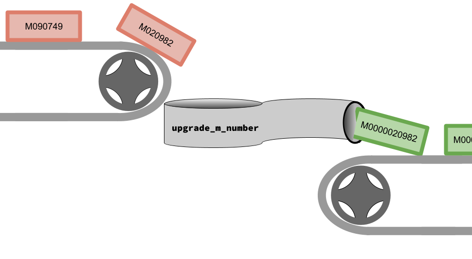
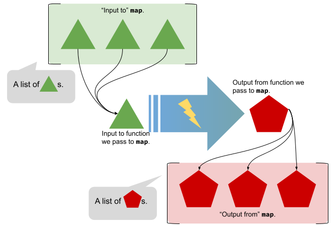

# The Tropic of Capricorn

> Note: This Functional Foundation implies that you need to have read/understood two earlier ones, but I do not believe that is necessary. Try to work through this Functional Foundation and if you need to return to earlier ones, there are links throughout.

## Introduction

Now that you are an expert at understanding how [loops can be rewritten using recursion](./fruit_loops.md) and how [higher-order functions](./high_order_functions.md) can give us a tremendous amount of power to customize an otherwise dreary function that seems to only be good at doing a single thing, we are ready to tackle a task (football season is starting this weekend, after all!) that will combine the two.

In this particular Functional Foundation we are going to focus on the latter (higher-order functions) and in the next one we will rely on our expertise about the former.

Okay, enough generalities, let's get down to writing some code!

## There's Just So Many Friends: An Application of Map

As we said before, although the idea of being able to pass functions as arguments to other functions is not something that may immediately strike you as revolutionary, I promise you that what we will see here is going to change the way you see code forever. You cannot unsee what you are about to learn! So, buckle up. 

As you know, the University is on a mission to educate as many people as possible. That's a laudable goal, but the college's technology is a little, well, dated and the IT department is running into a bit of a problem. In particular, the format of student M Numbers has limited the school's ability to enroll new students. Right now (at "UC"), there are only 6 digits in the M Number. That means that we are limited to enrolling (in all of history, if we never want a student to have to give up their unique M Number for recycling) $6^{10}$ students.

The IT staff has commissioned us to write some code that will go through a list of M Numbers in their current format and adjust each one so that:

1. It has a total of $12$ digits (all existing M Numbers will grow to $12$ digits by prepending $6$ `0`s) and
2. It starts with a capital `M` -- the new Catalyst software requires that all userids start with a letter, and not a number (progress, right?).

### One At A Time

Just to get a sense of our task, here are a few examples of existing M Numbers:
- `020982`
- `041485`
- `090749`

Although they are comprised of nothing but numbers, let's assume that they are actually stored in an internal UC database as strings.

Ultimately we want our code to be able to transform _all_ the old-format M Numbers into the new-format M Numbers. But, let's walk before we run and think about a function that would transform _one_ old-format M Number into _one_ new-format M Number.

The function will accept one of these old M Numbers and return a new one and we should make the signature of the function as specific as possible. After all there are tools out there that can analyze our Python and make sure that we don't call functions or use arguments with the wrong types. In Python, we can't _really_ encode the length of the string in the type,[^length-in-types] but we can be relatively clear, concise and helpful by giving the type of the function we are about to write (i.e., the one that takes a single old-format M Number and returns a single new-format M Number) as:

```Python
def upgrade_m_number(existing: str) -> str:
    return ""
```

[^length-in-types]: In some languages, however, you can encode the length of a string into its type! How cool!

Great. So, we have a function named `upgrade_m_number` whose signature[^signature] tells us that it takes a single parameter (with the type `str`) and returns a value whose type is also `str`.

[^signature]: The signature of a function is "a declaration of the function's name along with its return type and the types and ordering of its parameters. Sometimes this (sic) is called a function prototype." (Tucker, A. B., & Noonan, R. (2007). Programming languages : principles and paradigms. Mcgraw-Hill Higher Education.) We will talk about this term during the semester!

Just to be on the safe side, before the function upgrades an M Number, it should check that the given M Number is only 6 digits. That's just a little error handling. Then, if the given M Number is only 6 digits long, we will do the upgrade. Nothing fancy, then:

```Python
def upgrade_m_number(existing: str) -> str:
    new = existing
    if len(new) == 6:
        new = "000000" + new
    return "M" + new
```

Let's just give this a spin and see whether it works. 

```Python
old_m_number = "020982"
new_m_number = upgrade_m_number(old_m_number)
print(f"{new_m_number=}")
```

will print

```
new_m_number='M000000020982'
```

And,

```Python
old_m_number = "041485"
new_m_number = upgrade_m_number(old_m_number)
print(f"{new_m_number=}")
```

will print

```
new_m_number='M000000041485'
```

### On Repeat

Well, that's great! If we wanted job security, then we would be all set. We could ask the University for a list of existing M Numbers, then copy-and-paste each one into the `old_m_number` assignment statement in 

```Python
def upgrade_m_number(existing: str) -> str:
    new = existing
    if len(new) == 6:
        new = "000000" + new
    return "M" + new

if __name__=="__main__":
    old_m_number = "041485"
    new_m_number = upgrade_m_number(old_m_number)
    print(f"{new_m_number=}")
```

and record the output.

But, well, we know that we can do better. And, the best part? We don't have to tell anyone that we automated the process and that we are just loafing while while the computer does the work. We'll pretend to do tons of ardous manual data manipulation -- it'll be a secret!

So, the University has given us the data in an array and they have named it `existing_m_numbers`. They want the results to be put into a list named `updated_m_numbers`. Okay, I think we all know what is going to come next ... loop!

```Python
def upgrade_m_number(existing: str) -> str:
    new = existing
    if len(new) == 6:
        new = "000000" + new
    return "M" + new

if __name__=="__main__":
    existing_m_numbers = ['020982', '041485', '090749']
    updated_m_numbers = []
    for existing_m_number in existing_m_numbers:
        updated_m_numbers.append(upgrade_m_number(existing_m_number))
    print(f"{updated_m_numbers=}")
```

And, voila:

```
updated_m_numbers=['M000000020982', 'M000000041485', 'M000000090749']
```

### So. Much. Typing.

You all know that copying-and-pasting and excessive typing always annoy me! So, I think that we should explore a way that we could accomplish our task without having to write a loop. I mean, we don't really have anything else to do while our code is running.

Let's think about the situation as if it were a factory floor. There elements in the existing list are being delivered my conveyor belt to some machine. The machine accepts _one element at a time_ and converts it into some element with a different shape and then drops it on another conveyor belt which will take each new element to a storage location they are needed.

That seems like a fairly common thing to do. It would be neat if there was a way that the factory could be customized so that we could replace the processing machine whenever we wanted to transform items coming off the top conveyor belt into different types of items. 

What would that machine _have_ to look like? Well, it would have to have the proper shape to fit between the two belts -- that's the first thing. Then, it would have to have an opening of the proper size so that it could catch the items dropping into it. Finally, it would have to have a properly-sized exit to emit the new elements that it produces onto the lower conveyor belt! Otherwise, and here is the cool thing, that machine can do whatever it wants to those elements!



So, if that is such a common scenario, why did we have to write it ourselves?  Why did _we_ have to write that `for` loop? What would be really cool is if there were a function in Python that did the _conveyoring_ for us! 

If that were the case, _our_ job would be to deliver to the factory the machine to drop in between the belts and the items to place on the top conveyor belt one at a time.Python would do the rest!

Don't look now, but ... but, Python delivers the goods: [`map`](https://docs.python.org/3/library/functions.html#map). 

Before we get too excited, let's look at the documentation for `map` and see if we can figure out what goes where. Remember, we will need to give `map` two things:

1. The function to repeatedly apply (a.k.a., the machine); and
2. The list of elements (what is placed on the top conveyor belt).

Bonus quiz: Because `map` will need to take a function as a parameter, that makes it a ...? That's right, a higher-order function![^answer]

[^answer]: See [High Order Functions](./high_order_functions.md) for the definitions!

Okay, back to that documentation:

```Python
 map(function, iterable, *iterables)
 ```

 The Python documentation goes on to say:

 > Return an iterator that applies `function` to every item of `iterable`, yielding the results. 

 It goes on from there to talk about that magical `iterables` at the end, but we'll just assume it's not necessary for us.

 In other words, let's think about `map` as a high-order function that looks like

```Python
 map(function, iterable)
 ```

 Okay, so, when we want to use `map`, the first argument will be the function to apply to the list of elements, which we will give as the second argument.

 I think that it will make much more sense when we see how we can reduce the for loop to a single line of code. We can go from

 ```Python
    existing_m_numbers = ['020982', '041485', '090749']
    updated_m_numbers = []
    for existing_m_number in existing_m_numbers:
        updated_m_numbers.append(upgrade_m_number(existing_m_number))
    print(f"{updated_m_numbers=}")
`
 ```

 to

 ```Python
    existing_m_numbers = ['020982', '041485', '090749']
    updated_m_numbers = map(upgrade_m_number, existing_m_numbers)
    print(f"{updated_m_numbers=}")
 ```

### Uhm, What?

Even though we should have supreme confidence in ourselves, I think it would be wise to make sure that we see whether our code works. We expect identical results with our new, improved version. Let's remember what that result was:

```
updated_m_numbers=['M000000020982', 'M000000041485', 'M000000090749']
```

But, if we run our updated code, we get

```
updated_m_numbers=<map object at 0x70968d87ba20>
```

What in the world? What's happening is that Python is trying to be, well, "helpful". Python thinks that maybe, just maybe, you won't actually access each of the elements in the list that the `map` function returns. They are being a frugal factory operator and making a bet that we will never come collect the material that are put into storage when they come off the lower belt.

Python stashes away the function that we gave as an argument and the list into an object. Then, just at the time that we access each element in the list, Python will invoke the function on a single element and return that updated element. Python is gambling that we will not access all (or even many) of the elements. And if that gamble pays off, then there will be a huge savings!

But, we can force Python's hand (I had to switch to Vegas references because the factory analogy was getting tiresome) by putting the result inside `list`. That will make Python apply the function to every element immediately. With a small change


```Python
    existing_m_numbers = ['020982', '041485', '090749']
    updated_m_numbers = list(map(upgrade_m_number, existing_m_numbers))
    print(f"{updated_m_numbers=}")
```

we are back to getting the output we want:
```
updated_m_numbers=['M000000020982', 'M000000041485', 'M000000090749']
```

## Conclusion

What a whirlwind tour of the `map` function. Like I said, now that you have seen it, I bet that you will never look at a for loop the same way. While I was doing my PhD, I worked with a person who refused to write for loops. That would be strange enough if he and I were writing code in a functional programming language, but we were writing code in C++!!

In the next edition of the Functional Foundations, we will take a look at how to implement `map`. If you remember earlier, I asked you to hold on to a thought about how the types "match up". 



Let's say that the function we gave to `map` takes a type named _Triangle_ and returns a type named _Pentagon_ (we are assuming that _Triangle_ and _Pentagon_ are placeholders for actual types -- in other words, they are like variables whose types are, uhm, types (wow!)). With just that information, we should be able to write out the type of the function `map`. (We will use `List[X]` to indicate a list of things, each of which has type `X`. We will use `Func[[X],Y]` to indicate a function that takes a single parameter with the type `X` that returns a single value with the type `Y`.) 

```Python
def map(Func[Triangle, Pentagon], List[Triangle]) -> List[Pentagon]:
```

It all lines up so nicely.

But, does it really leave the person implementing `map` much room for creativity?

Hardly! Let's think about why: the caller of `map` can give a list of _any_ type, as long as it matches the type of input that they also give! As the implementer of `map`, then, we cannot make _any_ assumptions about the actual type of _Triangle_ or the type of _Pentagon_. 

Let's think about that for a second. We could use `map` to multiply every number in a list by $2$:

```Python
def multiply_by_2(input: int) -> int:
    return input * 2

print(f"{list(map(multiply_by_2, [2,4,6]))=}")
```

Or, we could make each character in a list uppercase:

```Python
def upper(input: str) -> str:
    return input.upper()

print(f"{list(map(upper, ['s', 'c', 'r', 'e', 'a', 'm']))=}")
```

(Note: We _had_ to use `str` as the types in this example because Python doesn't have a real character type -- at least I don't think!)

So, because the caller can use `map` to do all those operations (and more), as the implementer we are really limited in the assumptions that we are able to make about the types _Triangle_ and _Pentagon_. In fact, if you think about it hard enough, there is really only one way to implement `map` that will be right _in all_ cases. 

What we have here is the first example of how a language that allows us to be very precise with the types of our variables can (almost) force us into writing code that is correct _in all cases_. I don't think that it gets cooler than that.

